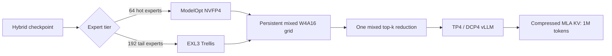

# GLM-5.2 NVFP4/TR3 Optimization on Blackwell

A reproducible vLLM/SparkInfer runtime and launch recipe for [`brandonmusic/GLM-5.2-NVFP4-TR3-Hybrid`](https://huggingface.co/brandonmusic/GLM-5.2-NVFP4-TR3-Hybrid) on four NVIDIA RTX PRO 6000 Blackwell GPUs.

Both recipes preserve the checkpoint's full **1,048,576-token context and KV capacity** with TP4/DCP4. The image defaults to greedy MTP4 for the C1 target; the explicit no-MTP recipe retains admission for eight sequences. The measured optimization target was **C1 at 0–64k context**.

## Result

| Metric | Stock | Retained no-MTP | Change |
|---|---:|---:|---:|
| Prefill geometric mean, 8k–64k | 1,777.97 tok/s | **2,659.18 tok/s** | **+49.6%** |
| Decode geometric mean, 0–64k | 19.70 tok/s | **46.33 tok/s** | **+135.2%** |
| Model/KV capacity | 1,048,576 | **1,048,576** | preserved |
| Sequence admission | 4 in the original launcher | **8** | restored target constraint |

### C1 matrix

| Context | Stock prefill | Final prefill | Stock decode | Final decode |
|---:|---:|---:|---:|---:|
| 0 / 8k | 2,038 tok/s | **2,750 tok/s** | 22.38 tok/s | **46.78 tok/s** |
| 16k | 2,001 tok/s | **2,666 tok/s** | 18.70 tok/s | **46.76 tok/s** |
| 32k | 1,638 tok/s | **2,642 tok/s** | 19.16 tok/s | **46.28 tok/s** |
| 64k | 1,496 tok/s | **2,581 tok/s** | 18.76 tok/s | **45.51 tok/s** |

The retained values average independent fused-query runs 175 and 177. Their decode results differed by at most 0.193%; matched control run 176 measured 45.78 tok/s geometric mean. The reproducible `runtime-v3` build contains byte-identical fused-query serving files and completed an exact-output API smoke at full 1M model/KV capacity.

The default C1-specialized greedy MTP4 recipe reached **90.29 tok/s decode geometric mean** at 0–64k. It is not the concurrent-service recommendation: MTP4 was poor under C4, while the explicit no-MTP recipe preserves dependable C8 admission and retained MTP3 is the stronger speculative C4 result.

Full findings, rejected experiments, and caveats are in [`REPORT.md`](REPORT.md). The development sequence is in [`MILESTONES.md`](MILESTONES.md).

### Published BF16-reference quality measurement

Checkpoint author **Brandon M. Music** published five teacher-forced, full-vocabulary comparisons against stored base-model BF16 logits for the hybrid serving path. With the production `nvfp4_ds_mla` KV format, mean KLD was **0.149049** (runs: 0.146681, 0.145467, 0.146602, 0.151969, 0.154528; sample SD 0.003968). The protocol scored 2,047 next-token positions from one fixed 2,048-token `Salesforce/wikitext` window per fresh boot, with TP4/DCP4 and speculative decoding disabled.

This is end-to-end candidate-output divergence, not a weight-only isolation of NVFP4/TR3 quantization. The evaluator source, stored BF16 logits, exact WikiText window, and KL direction were not published. See the immutable [machine-readable artifact](https://huggingface.co/brandonmusic/GLM-5.2-NVFP4-TR3-Hybrid/blob/1d10e2114aa8a3f0bde44809808bbddee168c93a/benchmarks/2026-07-18/kld-bf16-reference.json).

## What changed



The final stack combines:

- fused BF16 MLA query projection and direct query assembly;
- a persistent mixed NVFP4/Trellis W4A16 MoE kernel;
- planned Trellis prefill and decode paths;
- concurrent kept-NVFP4 and Trellis-tail execution where applicable;
- full compressed-KV gather through 64k tokens;
- 64-token KV blocks and an exact 4,096-block global KV budget;
- 5,120-token no-MTP scheduling, C8 admission, and graph ceiling 16;
- retained 128×128 mixed-kernel tiles for no-MTP decode;
- probabilistic dynamic MTP with MTP4 at C1, MTP3 at C2–C4, graph shapes through 20, 64×256 MTP tiles, and unmapped planned-Trellis routes skipped.

## Tested rig

- **GPU:** 4× NVIDIA RTX PRO 6000 Blackwell Max-Q, 96 GB each
- **Architecture:** SM120
- **Parallelism:** TP4 / DCP4, A2A backend
- **CUDA runtime:** 13.2.1
- **cuDNN:** 9.22
- **NCCL:** 2.30.4, PCIe-focused build
- **Model:** GLM-5.2 NVFP4/TR3 hybrid checkpoint

The kernels are architecture-specific. Other Blackwell configurations may work but are not benchmark-qualified by this repository.

## Quick start

### 1. Requirements

- Linux with a recent NVIDIA driver compatible with CUDA 13.2
- Podman or Docker with NVIDIA Container Toolkit support
- Four SM120 GPUs with enough aggregate VRAM for the model and exact 1M KV pool
- The Hugging Face checkpoint in the standard cache layout

Download the pinned checkpoint revision:

```bash
huggingface-cli download \
  brandonmusic/GLM-5.2-NVFP4-TR3-Hybrid \
  --revision 002eb6732dd8def0359915572eb5e22129244321
```

### 2. Build the runtime

```bash
./docker/build.sh
```

Or build the same local image through Docker Compose:

```bash
docker compose build runtime
```

The reproducible build pins the public base image plus exact vLLM, SparkInfer/B12X, and ExLlamaV3 revisions. It compiles the SM120 extension locally; model weights are not included.

Podman is the default. For Docker, use `CONTAINER_ENGINE=docker` for both build and launch commands.

### 3. Launch the default adaptive MTP recipe

```bash
./scripts/launch-mtp-dynamic.sh
```

The launcher uses probabilistic drafting and a batch-aware depth schedule:

- C1: MTP4
- C2–C4: MTP3
- CUDA graphs: `1,2,4,8,16,20`
- exact model/KV capacity: 1,048,576 tokens

Use the explicit no-MTP recipe for C8 admission:

```bash
./scripts/launch-no-mtp.sh
```

Useful overrides:

```bash
PORT=9300 \
MODEL_CACHE="$HOME/.cache/huggingface" \
CACHE="$HOME/.cache/vllm-glm52-tr3" \
./scripts/launch-mtp-dynamic.sh
```

The launcher stays attached as a supervisor, reports readiness, and terminates the container if startup or health checks fail.

### 4. Query the OpenAI-compatible API

```bash
curl http://127.0.0.1:9300/v1/chat/completions \
  -H 'Content-Type: application/json' \
  -d '{
    "model": "GLM-5.2",
    "messages": [{"role": "user", "content": "Explain NVFP4 briefly."}],
    "temperature": 0,
    "max_tokens": 128
  }'
```

## MTP results and concurrent serving

The retained C1 depth sweep used greedy drafting, TP4/DCP4, 2,048 scheduled tokens, compressed-KV gather through 64k, and exactly 1,048,576 model/KV tokens.

### C1 prefill

| Depth | 8k | 16k | 32k | 64k | Geometric mean |
|---|---:|---:|---:|---:|---:|
| MTP3, run 097 | 2,344 | 2,311 | 2,255 | 2,179 | **2,271.38 tok/s** |
| MTP4, run 114 | 2,329 | 2,288 | 2,250 | 2,181 | **2,261.34 tok/s** |

### C1 sustained decode

| Depth | 0 | 16k | 32k | 64k | Geometric mean |
|---|---:|---:|---:|---:|---:|
| MTP3, run 097 | 88.234 | 89.203 | 88.803 | 87.361 | **88.398 tok/s** |
| MTP4, run 114 | **90.507** | **90.995** | **90.836** | **88.849** | **90.293 tok/s** |

MTP4 improved the matched C1 geometric mean by 2.79%, but paying for a four-token draft at every concurrent batch was inefficient. The default launcher therefore dispatches MTP4 only at C1 and MTP3 at C2–C4.

### Corrected concurrent recipe

The concurrent path uses probabilistic drafting, graph shapes through 20 rows, mixed persistent MoE through M=4, planned Trellis above M=4, and skips unmapped NVFP4 routes in the Trellis plan.

| Run | Concurrency | Aggregate decode | Per request | Speculative cycle |
|---|---:|---:|---:|---:|
| 173 | C2 | **139.993 tok/s** | **69.996 tok/s** | **21.4325 ms** |
| 173 | C4 | **206.819 tok/s** | **51.705 tok/s** | **14.5939 ms** |

Both cells admitted every requested stream with zero request errors and retained exactly 1,048,576 model/KV tokens. Against the immediately following unchanged-map control, route skip improved cycles/second by 0.570% at C2 and 4.053% at C4. Across the broader three-candidate/two-control C4 sample, the conservative gain was **1.585%**. Raw throughput is acceptance-sensitive and is not used as the isolated source-change claim.

The padded-workspace correction also passed an exact 131,072-token C1 retrieval request and admitted all four streams at 128k/C4 with no queue or request errors. This is a correctness/admission qualification, not an exhaustive 1M retrieval proof.

Exact values are retained in [`results/summary.json`](results/summary.json); methodology and rejected variants are in [`REPORT.md`](REPORT.md).

## Container build details

Override the local output tag if needed:

```bash
IMAGE=localhost/glm52-tr3:runtime-v3 ./docker/build.sh
```

The launcher defaults to this local tag. Set `IMAGE` explicitly to use an independently built or published registry image.

## Benchmark and retrieval tools

The benchmark numbers were collected with [`local-inference-lab/llm-inference-bench`](https://github.com/local-inference-lab/llm-inference-bench). Machine-readable retained metrics are in [`results/summary.json`](results/summary.json).

Install the benchmark framework beside this repository at the measured revision:

```bash
git clone https://github.com/local-inference-lab/llm-inference-bench ../llm-inference-bench
git -C ../llm-inference-bench checkout 86cf05c2f42f4d21b909b6e684424ca1aab89fd5
```

With the server healthy on port 9300, run the exact C1 0–64k matrix using the normal full-screen Rich display:

```bash
PORT=9300 DISPLAY_MODE=screen ./scripts/bench-c1-0-64k.sh
```

The wrapper saves `runs/$RUN_ID/bench.json`. Use `DISPLAY_MODE=live` for inline updates or `DISPLAY_MODE=plain` for log-friendly output plus `bench.log`. Set `LLM_INFERENCE_BENCH` when the framework is not in the sibling directory.

Run the standalone long-context probe against a healthy server:

```bash
./tools/probe-long-context-retrieval.py \
  --host 127.0.0.1 \
  --port 9300 \
  --target-tokens 300000 \
  --needle-fraction 0.5 \
  --output result.json
```

## Repository layout

```text
config/       calibrated NVFP4 MLA scale asset
docker/       pinned source build
patches/      SparkInfer Trellis, mixed-kernel, and fused-query patch series
runtime/      vLLM integration, hybrid loader, kernel, entrypoint
scripts/      launch recipes and interactive C1 benchmark wrapper
tools/        deterministic long-context retrieval probe
results/      compact machine-readable benchmark summary
```

## Credits and license

This work is an integration and optimization effort built on substantial upstream engineering. See [`CREDITS.md`](CREDITS.md) and [`NOTICE`](NOTICE) for specific attribution to Z.ai, Brandon, David Young, local-inference-lab contributors, vLLM, SparkInfer/B12X, ExLlamaV3, NVIDIA, VerdictAI, and the other projects that made the result possible.

Repository-authored code is licensed under Apache-2.0. Upstream components and the model retain their own licenses and terms; see [`LICENSE`](LICENSE) and [`NOTICE`](NOTICE).
